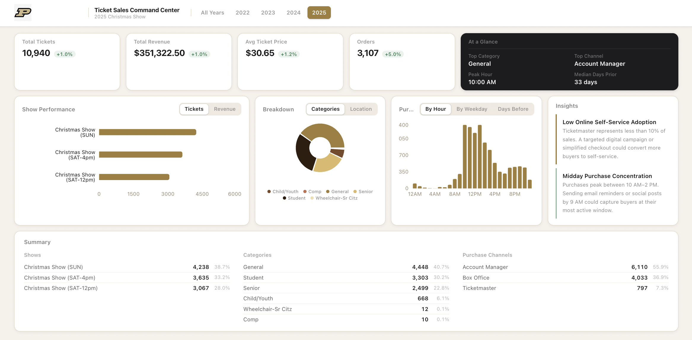
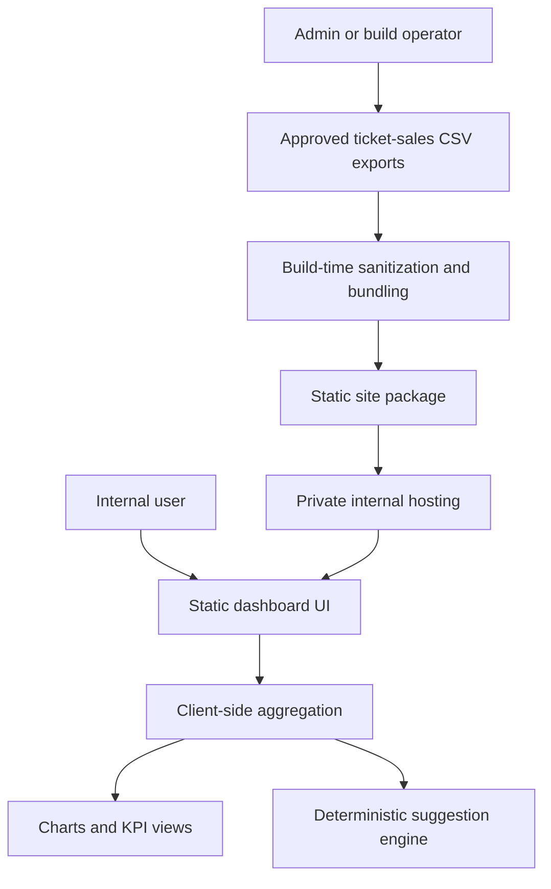

# Ticket Sales Command Center

> A public, documentation-only showcase for a private ticket-sales analytics dashboard that turns event sales exports into decision-ready insights.

## Product Overview

Ticket Sales Command Center is a private analytics dashboard built for event and venue teams that need a fast way to understand sales performance across multiple seasons. The production application ingests approved ticket-sales CSV exports, normalizes inconsistent source formats, and presents a compact command-center view of revenue, orders, buyer timing, event performance, category mix, sales channels, and recommendation prompts.

This public repository is intentionally a showcase. It documents the product, architecture, feature set, and engineering decisions without exposing the private source code, client data, database details, proprietary parsing rules, secrets, or deployable application bundle.

## Why I Built It

Ticket-sales reporting often lives in static exports, disconnected spreadsheets, and manual year-over-year comparisons. I built this project to make those reports easier to interpret for stakeholders who need answers quickly: which shows sold best, when customers purchased, which ticket categories drove attendance, and where operational improvements could increase conversion.

## Problem It Solves

Event teams need more than raw ticket counts. They need a repeatable way to answer:

- Which events or performances are driving the most tickets and revenue?
- How does the current season compare to prior years?
- Which purchase channels are most important?
- When do buyers make purchase decisions?
- Which audience segments are over- or under-represented?
- What practical actions could improve sales operations?

## Target Users

- Event operations teams
- Ticketing and box office managers
- Sponsorship and marketing teams
- Arts, athletics, and venue administrators
- Stakeholders who need high-level sales visibility without working directly in spreadsheets

## Core Features

- **Multi-year dashboard:** Compare all available years or isolate a single season.
- **KPI summary strip:** Track total tickets, revenue, orders, average ticket price, top category, top location, peak purchase hour, and median purchase timing.
- **Year-over-year context:** Show prior-year deltas when a single year is selected.
- **Event performance ranking:** Surface the strongest performances by tickets and revenue.
- **Category and channel breakdowns:** Compare ticket categories and purchase locations.
- **Purchase timing analysis:** Visualize hourly, weekday, and days-before-event buying patterns.
- **Rules-based suggestions:** Generate deterministic operational recommendations from observed trends.
- **CSV ingestion workflow:** Support approved preloaded datasets and a local/admin upload mode for future-year exploration.
- **Private static delivery model:** Package a sanitized static build for internal hosting without requiring end-user Node.js, a database, or an application server.

## Screenshots

> Replace these placeholders with sanitized screenshots that use mock, redacted, or approved non-sensitive data.

Caption: Full dashboard view showing the sticky header, year filter, KPI row, analysis panels, and compact summary table.

Caption: KPI cards for total tickets, revenue, orders, average ticket price, top segment, top sales channel, and purchase timing metrics.

Caption: Multi-year selector demonstrating the ability to switch between all-years analysis and individual season views.

Caption: Ranked show or event performance chart comparing ticket volume and revenue contribution.

Caption: Ticket category and purchase-location breakdowns for understanding audience composition and channel dependency.

Caption: Timing analysis for hourly purchasing, weekday trends, and how far in advance buyers commit.

Caption: Deterministic recommendation panel that translates sales patterns into operational next steps.

Caption: Admin-only CSV upload flow for testing or adding future-year data outside client delivery mode.

Caption: Sanitized build artifact and internal-hosting handoff flow, shown without private filenames, URLs, or source data.

## Feature Walkthrough

1. **Load approved sales data:** The private application loads pre-approved, sanitized ticket-sales data for supported years.
2. **Select the analysis scope:** Users can view all years together or focus on a specific year.
3. **Scan top-level performance:** KPI cards summarize sales, revenue, order behavior, category leaders, and purchase timing.
4. **Diagnose drivers:** Charts show which events, ticket types, and purchase channels contribute most to results.
5. **Understand buyer behavior:** Timing views highlight when purchases cluster and how close to event dates buyers decide.
6. **Act on recommendations:** A deterministic rules engine flags patterns such as late-cycle buying, channel imbalance, or underused self-service purchasing.

## Tech Stack

| Layer | Technology | Purpose |
| --- | --- | --- |
| Frontend | Next.js, React, TypeScript | Static dashboard UI and state-driven analytics views |
| Styling | Tailwind CSS | Responsive, polished command-center interface |
| Visualization | Recharts | KPI, bar, pie, and timing charts |
| Data Parsing | Papa Parse | CSV parsing and normalization |
| Build Tooling | Node.js, npm | Data bundling, static export, and release packaging |
| Deployment Model | Static hosting | Private intranet, VPN, SSO-protected reverse proxy, or internal web server |
| Automation | Deterministic rule engine | Recommendation prompts based on aggregated dashboard metrics |

## Architecture Overview

The private application is structured as a static client-rendered analytics dashboard. Approved CSV exports are processed during packaging, transformed into a sanitized browser-safe data bundle, and delivered as a static build for private hosting. The runtime dashboard computes aggregate views in the browser and does not require an application server for end users.

## Data Flow Overview

1. Approved private ticket-sales CSVs are stored outside the public web root.
2. A build-time packaging step reads only approved source files.
3. Sensitive fields are sanitized before the data is bundled for the browser.
4. The static dashboard loads the sanitized bundle from the private build.
5. Client-side aggregation computes KPI, event, category, channel, and timing views.
6. Deterministic rules generate recommendation cards from aggregate patterns.

## AI/ML Or Automation Components

This project does not rely on an external AI or LLM service. Recommendations are generated by deterministic business rules so outputs are explainable, repeatable, and easy to validate for stakeholder-facing analytics.

The automation focus is in the packaging workflow: approved data is bundled, sanitized, statically built, and prepared for private handoff without exposing raw source files.

## Engineering Highlights

- Designed a static deployment model that avoids runtime infrastructure for end users.
- Separated raw client data from public assets and build output.
- Added build-time sanitization before browser delivery.
- Normalized inconsistent historical CSV formats into a consistent analytics model.
- Memoized derived dashboard views for instant year switching.
- Built a compact dashboard layout that balances executive summary and operational detail.
- Used deterministic rules instead of opaque AI outputs for business recommendations.
- Documented private handoff constraints to reduce accidental exposure risk.

## Security, Privacy, And IP Notice

This repository intentionally excludes:

- Application source code
- Raw or generated client datasets
- API keys, credentials, internal URLs, or environment variables
- Database schemas or private infrastructure details
- Proprietary parsing rules beyond high-level descriptions
- Static build artifacts or deployable packages

All screenshots should use sanitized, mocked, redacted, or explicitly approved data before this repository is published.

## What I Learned

- How to design a public technical narrative around a private project without leaking implementation details.
- How to package sensitive analytics work for private static hosting.
- How to turn inconsistent operational exports into a repeatable dashboard model.
- How to balance stakeholder-friendly summaries with deeper diagnostic views.
- How to make recommendation logic explainable and auditable instead of opaque.

## Future Improvements

- Add a server-side admin upload flow with persistent storage and audit history.
- Add role-based access controls around admin-only workflows.
- Expand trend analysis for campaign periods, seat tiers, and buyer cohorts.
- Add exportable PDF or slide-ready reporting snapshots.
- Add automated validation checks for future CSV formats.
- Introduce synthetic demo data for public screenshots and portfolio demos.

## Project Status

Private production-style dashboard complete. Public repository status: documentation-only showcase in progress, awaiting sanitized screenshots.

