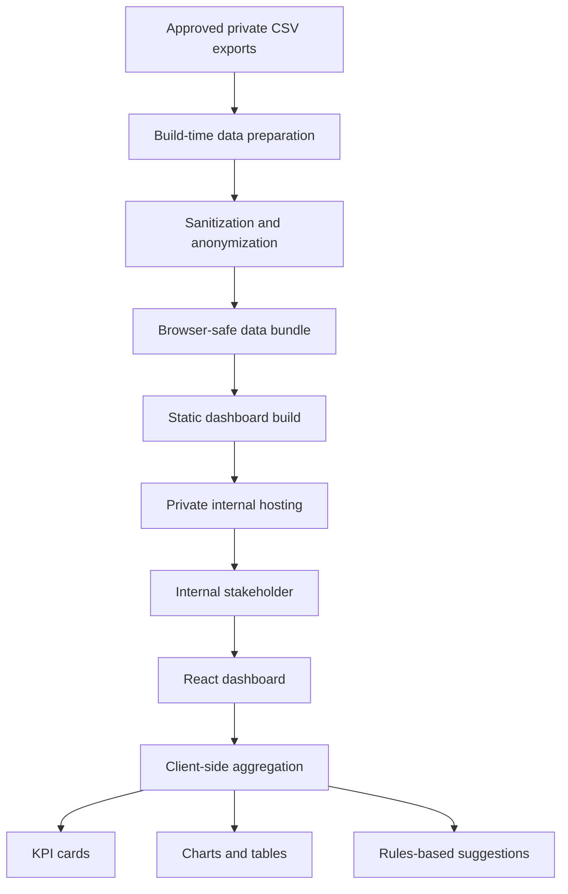
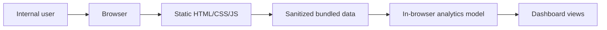

# Architecture

## Overview

Ticket Sales Command Center is architected as a private static analytics dashboard. The production application does not expose a public API, public database, or public source bundle. Approved data is prepared during a build/package step, sanitized, and served through an internal static hosting environment.

This document describes the architecture at a public, non-sensitive level.

## Frontend Layer

The frontend is a React and Next.js dashboard built with TypeScript. It provides:

- Sticky header and year selection controls.
- KPI cards with current-period and prior-period context.
- Chart panels for event performance, category mix, channel mix, and purchase timing.
- Compact summary tables for quick comparison.
- A suggestion panel generated from deterministic business rules.
- A hidden-by-default admin upload workflow for local exploration.

The dashboard is client-rendered after loading the approved bundled data included in the private static build.

## Backend/API Layer

The private deployment model intentionally avoids a runtime backend for normal end users. There is no public API service in the static handoff version.

Backend-like work happens during packaging:

- Approved source files are read from private directories.
- Data is normalized into a dashboard-friendly shape.
- Sensitive fields are reduced, removed, or anonymized before browser delivery.
- A static site package is produced for internal hosting.

Future versions could introduce a server-side admin API for persistent uploads, audit history, authentication, and role-based controls.

## Data Layer

The project uses ticket-sales CSV exports as its source data. In the private application, raw CSV files are not placed in public assets. A build-time process creates a sanitized browser data bundle from approved files.

At runtime, the dashboard derives:

- Total tickets
- Total revenue
- Average ticket price
- Total orders
- Top ticket category
- Top purchase location
- Event-level performance
- Category breakdowns
- Sales channel breakdowns
- Hourly purchase patterns
- Weekday purchase patterns
- Days-before-event purchase patterns

The public showcase does not include source datasets, generated bundles, row-level data, or schema details beyond this high-level description.

## External APIs

The static handoff version does not require external runtime APIs. Data is packaged before deployment, and charts are computed from the private static bundle.

Potential future integrations could include:

- Ticketing platform APIs
- Internal data warehouses
- Authentication providers
- Reporting or email distribution tools

## AI/LLM Services

The current project does not depend on AI or LLM services. Recommendations are generated through deterministic rules over aggregate metrics. This choice keeps the recommendation layer:

- Explainable
- Repeatable
- Low-cost
- Easy to audit
- Appropriate for stakeholder-facing analytics

## Authentication And Security

The static handoff assumes access is controlled by the client or organization hosting environment, such as:

- Internal network access
- VPN routing
- SSO-protected reverse proxy
- Private cloud endpoint
- Intranet web server permissions

The application also follows a conservative data-handling model:

- Raw CSV files are kept outside public assets.
- Build artifacts are treated as private.
- Sensitive fields are sanitized before browser delivery.
- Client mode hides non-persistent upload controls.
- Secrets are not stored in frontend code.

Because static dashboards deliver bundled data to the browser, anyone with access to the private URL can inspect that browser-delivered data. Access control for the URL and artifact is therefore part of the security model.

## Deployment Assumptions

The private production-style handoff is a static site package. It can be hosted behind internal access controls on common static web servers or private cloud hosting.

End users do not need:

- Node.js
- npm
- A database connection
- Environment variable configuration
- A repository checkout
- Local CSV files

Build operators do need a controlled development/build machine with the required Node.js and package tooling.

## High-Level Data Flow

## Runtime View

## Public Showcase Boundary

This public repository documents the architecture only. It does not include:

- Application source files
- Private datasets
- Generated browser data bundles
- Internal deployment instructions
- Secrets or credentials
- Client-specific schemas
- Proprietary implementation details

